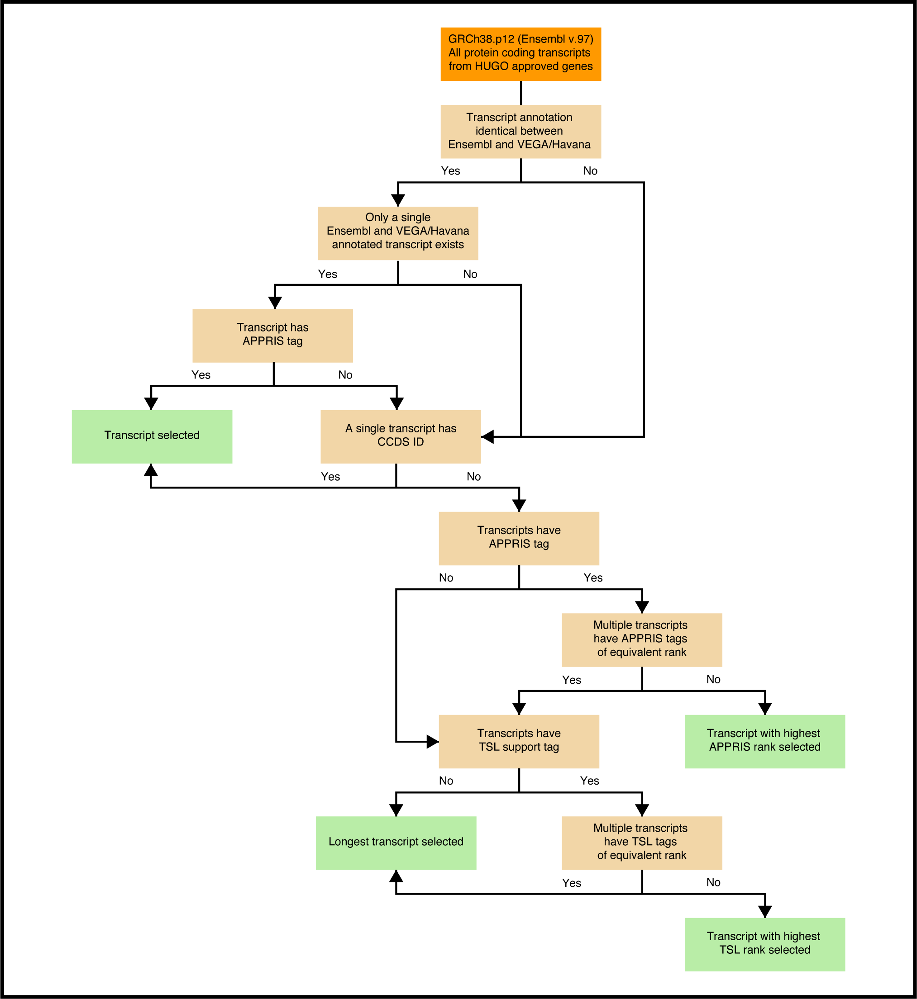

## Ribosome Profiling
The main scripts & their documentation for Ribosome Profiling analysis

----------------------------------------------------------------

**Author:** Kübra Altinel

**Complitation date:** 23rd July 2022

**Last update:** 23rd June 2023

----------------------------------------------------------------

### Description:
The codes required to do ribosome profiling analysis. This work has been done for:
* Jansson, M.D., Häfner, S.J., Altinel, K. et al. Regulation of translation by site-specific ribosomal RNA methylation. Nat Struct Mol Biol 28, 889–899 (2021). https://doi.org/10.1038/s41594-021-00669-4
* Häfner, S.J., Jansson, M.D., Altinel, K. et al. bioRxiv 2022.09.24.509301; doi: https://doi.org/10.1101/2022.09.24.509301 

#### The summary of the analyses is as follows:
1) The sequencing data was demultiplexed using Illumina bcl2fastq (v2.20.0.422). Parameters: ```–barcode-mismatches 1 --create-fastq-for-index-reads --no-lane-splitting```
2) Adaptor sequences were removed with cutadapt (v1.18) Parameters: ```-q 30,30 --minimum-length 20 --discard-untrimmed --trim-n -o ```
3) Reads derived from RPF and total RNA were aligned to known human rRNA and tRNA sequences with bowtie2 (v2.2.9). Mapped reads were discarded. Parameters: ```--local -D 20 -R 3 -N 1 -L 20 -i S,1,0.75```
4) Cleaned reads were aligned to GRCh38.p12 (Ensembl v.97) with STAR (STAR-2.5.1a). Only reads mapping to HUGO approved genes were retained for downstream analysis. Parameters: ```--runMode alignReads –outFilterMultimapNmax 50 --outFilterMismatchNoverLmax 0.075 --outFilterScoreMinOverLread 0 --outFilterMatchNminOverLread 0.95 --outSAMheaderCommentFile COfile.txt --outSAMattributes All --outSAMheaderHD @HD VN:1.4 SO:coordinate --genomeLoad NoSharedMemory --outSAMunmapped None  --outSAMtype BAM SortedByCoordinate --quantMode TranscriptomeSAM  --limitBAMsortRAM 60000000000 --chimSegmentMin 1 --chimOutType SeparateSAMold --twopassMode Basic outWigType wiggle```
5) RPF read alignment files were analyzed by Ribotaper for their tri-nucleotide periodicity, and then accordingly filtered with samtools (v1.10) to retain only certain read lengths . No read length filtering was applied to the total RNA alignment files.
6) The transcript coordinate alignments files were converted into genomic coordinate alignments with RSEM. Commands: ```rsem-prepare-reference and rsem-tbam2gbam```
7) A single canonical transcript representing each protein-coding gene was selected from Ensembl GRCh38 gtf file. FeatureCounts (v1.5.1) was used to generate counts of reads mapping to exons of these transcripts for total RNA and RPF. Parameters:``` **i.exon**: featureCounts -R  -t exon -g transcript_id -O -M -Q 0 --largestOverlap   **ii.3UTR**: featureCounts -R  -t three_prime_utr -g transcript_id -O -M -Q 0 --largestOverlap --fracOverlap 0.72  **iii.5UTR**: featureCounts -R  -t five_prime_utr -g transcript_id -O -M -Q 0 --largestOverlap --fracOverlap 0.53 ```
8) RPF and total RNA alignment files were extracted to have only exon assigned reads in FeatureCounts. All alignments were converted to CPM normalized wig files with bamCoverage functionality of deeptools (v3.3.1).  Replicates of each library were merged with WiggleTools (v1.2.3) and converted to bigwig files with wigToBigWig (v4). Paremeters: ```bamCoverage –binSize 1 --normalizeUsing CPM  && wiggletools write mean && wigToBigWig```
9) Exon spanning alignments of RPF and total RNA were converted to bigwig files with deeptools (v3.3.1). Replicates for each condition were CPM normalised individually. The Replicates from each condition were merged by calculating their mean coverage per base. For RPF bigwig files, only exon spanning X-Y nt reads were included. For total RNA bigwig files, no filtering for read length applied. Reads mapping to the canonical transcripts selected to represent each protein-coding are included in the bigwig files.


The associated scripts are listed as follow:
1. The sequencing data were demultiplexed using Illumina bcl2fastq. --> ``` 1_bcl_to_fastq.sh ```

2. Quality of the sequencing files was controlled with fastqc and adapter sequences were removed with cutadapt. --> ``` quality_control_and_adapter_trimming.sh ```

3. Reads derived from RPF and total RNA were aligned to human rRNA and tRNA sequences with bowtie2 (v.2.2.9) and the mapped reads discarded. --> ```rRNA_tRNA_contamination_removal.sh ```

4. The remaining reads were aligned to GRCh38.p12 (Ensembl v.97) with Spliced Transcripts Alignment to a Reference (STAR) software to both transcriptome and genome coordinates. --> ``` STAR_Alignment.sh ```

5. Reads mapping to Human Genome Organisation (HUGO) approved genes were used for downstream analyses. We use GRCh38_Ensembl_Genome. 
Filename: _Homo_sapiens.GRCh38.dna.primary_assembly.fa_

    * You can get it from ftp://ftp.ensembl.org/pub/release-97/fasta/homo_sapiens/dna/Homo_sapiens.GRCh38.dna.primary_assembly.fa.gz. 

    We use a custom made HUGO GTF file, please see ``` making_custom_hugo_GTF.sh ``` for its details. Filename: HUGO_V97_Homo_sapiens.GRCh38.97_HUGO-filtered.gtf

1. RPF read lengths were analyzed for trinucleotide periodicity using Ribotaper. RPF reads with lengths between X and Y nucleotides were selected and the optimal P-site offset was defined as position Z from 5′ read ends. No read length filtering was applied to the total RNA alignment files.  --> ``` Ribotaper.sh ```

    We used Ribotaper very early in our analysis, therefore we used a different source genome (We used Gencode for this, not Ensembl like the rest of the analysis). We used Gencode: GRCh38.p12, release 31 referring to the ENSEMBL V97 as the rest of the analysis.
    _We used Gencode genome as this genome was used in their paper so we wanted to fit the tool requirement for GTF formatting._

2. The transcript coordinate alignment files obtained from STAR were converted into genomic coordinate alignments with RSEM.
--> ``` genome_to_txtome_with_RSEM.sh ```.

1. A single canonical transcript representing each protein-coding gene was selected from the GRCh38, v.97 Ensembl annotation file. I wrote the script/documentation for it and it is a complicated one so it needs to be followed carefully. -->  ``` FeatureCounts_TX_selection.sh ```
.

1. FeatureCounts was used to generate counts of reads mapping to exons of these selected transcripts for both total RNA and RPF. --> ``` Featurecounts_for_TxtoGenome_alinments.sh ```

2.  RPF reads with ribosome P-site positions mapping within transcript coding region sequences (CDS) were again counted using FeatureCounts. This is only done for RPF reads. For RNAseq reads, we use exon as target mapping features. RPF-CDS mapped reads from RPF libraries and the mRNA exons mapped reads from RNAseq libraries are used for further measurements of differential translation and mRNA expression.  --> ``` Make_RIVET_ready_FeatureCounts_table.R ``` and ``` CDS_extracted_RPF_alignment_files.sh ```
    
3.  Ribosomal investigation and visualization to evaluate translation (RIVET) was used for translation and expression analysis of the representative transcripts (similar results were obtained for gene-level analysis).
    No fold change cut-offs were directly applied so that more subtle changes in translation could also be detected. Regulated transcripts were therefore nominally identified by statistical significance. 
    Translation regulation categories were defined according to RIVET on the basis of mRNA expression and ribosome occupancy, derived from normalized total RNA read counts or RPF read counts mapping to protein-coding mRNA transcripts (CDS), respectively.

4.  Plots from the resulting RIVET output files were generated using the ggplot2 package in R. : This step is done by Martin Jansson. I will add these scripts to here. **#TODO**
 
5.  GO and GSEA : All GO analyses of ribosome profiling and proteomic data were performed using WebGestalt using the over-representation test against the GO biological process database58. GSEA was performed using GSEA software (v.4.0.3). Genes for analysis were preranked according to log2 FC in translation from RIVET analysis (Padj < 0.05) and compared to a custom gene set (containing 112 distinct human genes) compiled from those previously described to contain experimentally validated IRES elements, or that associated with polysomes following cap-dependent translation inhibition.

    :This is done by Martin Jansson. I will add these scripts to here. **#TODO**

_**Metagene analysis will start with this point.**_

14. For metagene analyses, bam files containing exon-mapped reads for each library were converted to normalized reads per kilobase per million (RPKM) or counts per million reads (CPM) single-nucleotide resolution coverage bigwig files, with bamCoverage from the deepTools suite. WiggleTools (Ensembl) and wigToBigWig (Encode, kentUtils) were then used to merge these and create mean coverage files per condition. --> ``` BigWig_from_exon_mapped_reads.sh ``` 

15. I created annotation files containing the exon coordinates for the selected mRNA transcripts.--> ``` Make_BEDfiles_from_RIVETlists_for_Deeptools_ComputeMatrix.sh```

16. The BigWigs collected from 15th Step are given to deepTools computeMatrix, together with an annotation file containing the exon coordinates for the selected mRNA transcripts (prepared in 14th Step).

    _The GTF and the BED files made in 15th Step._

17. CountMatrix, Scale Regions: For RPF coverage over all transcripts, a count matrix was then generated for library RPKM RPF coverage over the coding regions (CDS) (made by ```Make_BEDfiles_from_RIVETlists_for_Deeptools_ComputeMatrix.sh```) , scaled to size 100 nt, flanked by unscaled regions before and after the translation start (TSS) and end (TES) sites. --> ``` CountMatrix_Scale Regions_RPF_RPKMnormalized.sh ```

18. For further analysis, the scaled coverages of transcripts comprising the different translationally regulated categories were extracted from this matrix and median values at each position plotted. :This is done by Martin Jansson. I will add these scripts to here. **#TODO**

19. CountMatrix, Reference point: For average ribosome occupancy, CPM normalization was used and offset applied using bamCoverage, so as to use only the nucleotide position representing the ribosome P-site for each read as the signal. The P-site coverage files were input to computeMatrix and a count matrix generated for −30 to +330 or −330 to +30 nucleotides, relative to the CDS start or end site respectively for each transcript (unscaled). --> ``` CountMatrix_ReferencePoint.sh ```

20. The resulting counts at each position were divided by the total RPF count in CDS for each corresponding transcript to give the average ribosome occupancy per nucleotide position in each transcript. 

    The mean values at each equivalent nucleotide position relative to the translation start site were plotted after extreme outlier removal (>3x interquartile range), no smoothing was applied. For P-site CPM the same matrices were used, although here the counts at each position were summed at each nucleotide position. 

    For plotting, extreme outliers (>3x interquartile range) were removed. :This is done by Martin Jansson. I will add these scripts to here. **#TODO**

21. The GTF files will be added. **#TODO**
----------------------------------------------------------------
### Submission Details

The RNA sequencing data have been deposited to GEO under accession code GSE153476 (for https://doi.org/10.1038/s41594-021-00669-4) & GSE199387 (for https://doi.org/10.1101/2022.09.24.509301)

----------------------------------------------------------------

### Notes:
* ALL has every feature of every transcript, and COUNTED has exons of selected transcripts.
* REFERENCE POINT:
    I used CPM & REGULAR(=no normalization) with for offset_P site and nooffset, for ALL/NS/DOWN/UP.
* SCALE REGIONS :
    I used RPKM with nooffset for ALL/NS/DOWN/UP.

### Done :) ###
